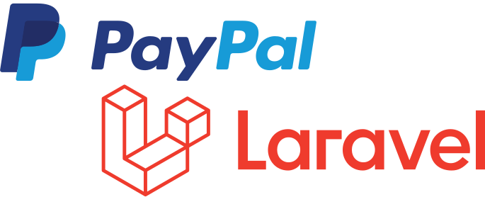

<p align="center"><a href="https://qubenext.com" target="_blank"></a></p>

### Install
```shell
composer require aamroni/paypal
```

### Config Example
Collect your public and secret keys, and configure as necessary in config/payment.php

```php
'paypal' => [
    'client'        => env('PAYPAL_CLIENT_KEY'),
    'secret'        => env('PAYPAL_SECRET_KEY'),
    'redirect'      => [
        'success'   => sprintf('%s/paypal/success', env('APP_URL')),
        'cancel'    => sprintf('%s/paypal/cancel', env('APP_URL')),
    ],
    'currency'      => 'USD',
    'tax_rate'      => 0,
    'insurance'     => 0,
    'additional'    => 0,
    'shipping'      => [
        'discount'  => 0,
        'netPrice'  => 0
    ]
],
```

### Checkout Example
```php
<?php

use Aamroni\PayPal\Entities\ProductsEntity;
use Aamroni\PayPal\Entities\PurchaseEntity;
use Aamroni\PayPal\Entities\ShippingEntity;
use Aamroni\PayPal\Facades\PayPal;
use Aamroni\PayPal\PayPalPaymentManager;

// @step01: Create a products information
$products =  ProductsEntity::instance(
    title: 'FoldSack No. 1 Backpack, Fits 15 Laptops',
    sku: 'SKU-FBFL',
    quantity: 1,
    regular: 109.95,
    offered: 99
);

// @step02: Create a shipping information
$shipping = ShippingEntity::instance(
    name: 'Valdemar Christensen',
    mobile: '+1 319-543-5636',
    street1: '3210 Pyramid Valley Road',
    city: 'Roanoke',
    postal: '24035',
    state: 'Virginia',
    country: 'US'
);

// @step03: Create a purchase information
$purchase = PurchaseEntity::instance(total: 10);

// @step04: Process the Stripe checkout
$paypal = PayPal::checkout(invoice: $invoice, products: $products, shipping: $shipping, purchase: $purchase);
// or
$paypal = PayPalPaymentManager::instance()->checkout(invoice: $invoice, products: $products, shipping: $shipping, purchase: $purchase);

dd($paypal);
```
